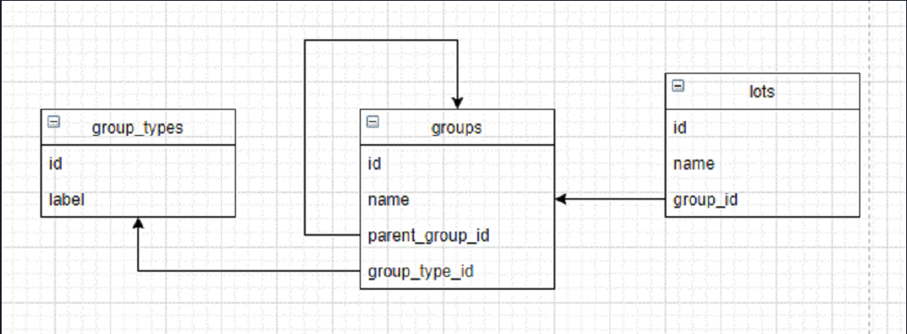

# API_Laravel
* Modèles configurés avec clefs étrangères et relations récursives
* Seeder pour les groupes et types de groupe
* Factory via regex pour les lots
* Controllers complet pour CRUD
* Vérification du respect de l'intégrité du modèle de données lors des modifications  (relations récursives, existence de la clef étrangère,etc)
* Vérification de la conformité des données envoyées lors des requêtes POST/PUT

## Schéma conceptuel de la base de données

* Dans la table « groups », le champ « parent_group_id » comporte une clé étrangère vers le champ « id » de la table « groups ». Il s'agit d'une relation récursive.

## Configuration Laragon / WAMP / XAMP
1. Création d'une BDD MySQL **'db_api'** -> [username: root, password: ' ']
2. ‼️ L'extension **'pdo_mysql'** et **'fileinfo'** doit être activée dans le fichier php.ini

## Installation
1. `cd .../www`
2. `git clone https://github.com/Yeulmax/test_realiz3D_laravel.git`
3. `cd test_realiz3D_laravel`
4. `composer update`
5. `composer install`
6. `copy .env.example .env`
7. Dans le fichier .env -> `DB_DATABASE=db_api`
8. `php artisan key:generate`
9. `php artisan migrate --seed`

## Routes API
‼️  *Les paramètres sont passés via un multipart form*
* #### /lots : Accés au lots
  * **GET** .../api/lots  -> Renvoie la liste des lots
  * **GET** .../api/lots/{id} -> Renvoie un lot spécifique
  * **POST** .../api/lots -> Crée un lot
    * name: String
    * group_id: Int (doit exister dans la table 'groups')
  * **PATCH** .../api/lots/{id} -> Modifie un lot
    * name: String
    * group_id: Int
  * **DELETE** .../api/lots/{id} -> Supprime un lot

* #### /groupTypes : Accés aux types de groupes
  * **GET** .../api/groupTypes  -> Renvoie la liste des types
  * **GET** .../api/groupTypes/{id} -> Renvoie un type spécifique
  * **POST** .../api/groupTypes -> Crée un type
    * label: String
  * **PATCH** .../api/groupTypes/{id} -> Modifie un type
    * label: String
  * **DELETE** .../api/groupTypes/{id} -> Supprime un type

* #### /groups : Accès aux groupes
  * **GET** .../api/groups  -> Renvoie la liste des groupes
  * **GET** .../api/groups/{id} -> Renvoie un groupe spécifique
  * **POST** .../api/groups -> Crée un groupe
    * name: String
    * parent_group_id: Int (doit exister dans la table 'groups')
    * group_type_id: Int (doit exister dans la table 'group_types')
  * **PATCH** .../api/groups/{id} -> Modifie un groupe
    * name: String
    * parent_group_id: Int (doit exister dans la table 'groups')
    * group_type_id: Int (doit exister dans la table 'group_types')
  * **DELETE** .../api/groups/{id} -> Supprime un lot
